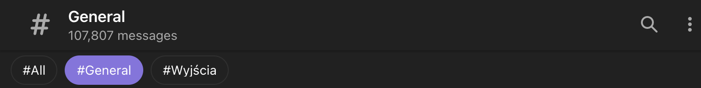

# Telegram Topic One-Click

A Chrome extension for [Telegram Web A](https://web.telegram.org/a/) that replaces the forum-topics sidebar with a **mobile-style horizontal topic strip** at the top of the chat, and **auto-opens the most recently active topic** when you enter a forum group.

It fixes terrible multi click UX where you had minimum 2-3 clicks to before you could send a message.

Targets only `web.telegram.org/a/*`. The K version (`/k/`) is not supported.

## Install (development)

1. Clone this repo.
2. Open `chrome://extensions` in Chrome (or any Chromium browser).
3. Toggle **Developer mode** on (top right).
4. Click **Load unpacked** and select this folder.
5. Open <https://web.telegram.org/a/> and navigate to a group with topics enabled.

To pick up code changes, hit the reload icon on the extension card and refresh the Telegram tab.

## How it works

- A content script runs on `https://web.telegram.org/a/*` at `document_start`.
- It watches the DOM with a `MutationObserver` for the appearance of the forum topic panel (the sidebar that slides in over the chat list when you open a forum group).
- When detected, it:
  1. Auto-clicks the first (most recent) topic so a chat is visible immediately.
  2. Renders a horizontal strip of topic chips just below the chat header.
  3. CSS-hides the original sidebar.
- Clicking a chip programmatically clicks the corresponding underlying topic row, so Telegram's own routing handles the navigation.

The original DOM is preserved (only hidden via CSS), and no React/Teact internals are touched — just DOM events.

## Updating selectors

Telegram Web A uses CSS Modules, so build-hashed class names (like `ForumPanel_root_ab12c`) **will change** between Telegram releases. The extension intentionally does **not** hardcode hashed module classes — it relies on stable, non-module class names (`.MiddleHeader`, `.chat-list`, `ListItem` structure) plus structural heuristics.

If Telegram ships a breaking DOM change, the selectors are centralized at the top of [`src/content.js`](src/content.js). Update them there.

## Out of scope

- Telegram Web K (`/k/`).
- Mobile web layout.
- Settings UI.
- Reordering / pinning / searching topics from the strip.
